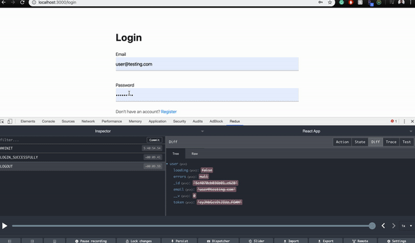

# MERN
Project to build strengths in MERN/ React

## Purpose
Enhance an existing e-commerce platform called Shop-Shop. 
Centralize all of the application's data in state globally to make it easier to share state across the entire application. 
Create a shopping cart for the application, add offline functionality, and process secure online payments with a service called Stripe.

## Built With
* React.js
* Redux-thunk
* React-router
* LocalStorage
* Axios
* Node.js
* Express.js
* MongoDB
* Postman
* Git Hub

## Contribution
Made with ❤️ by Samantha Malone
Shout out to Calvin Nguyen
© 2022 Samantha Malone. All rights reserved.
